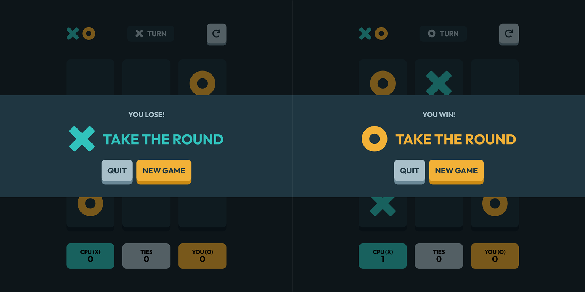

# Tic Tac Toe

This is my solution to the [Tic Tac Toe Project on The Odin Project](https://www.theodinproject.com/paths/foundations/courses/foundations/lessons/tic-tac-toe), using [Frontend Mentor's Tic Tac Toe game design](https://www.frontendmentor.io/challenges/calculator-app-9lteq5N29).

## Table of contents

- [Overview](#overview)
  - [The goals](#the-goals)
  - [Screenshot](#screenshot)
  - [Links](#links)
- [My process](#my-process)
  - [Built with](#built-with)
  - [Continued development](#continued-development)
  - [Useful resources](#useful-resources)
- [Author](#author)

## Overview

### The goals

- Play the game either solo vs the computer, or multiplayer against another person
- A button to restart the game 
- A display element that congratulates the winning player!

### Screenshot

### Links

- [View code solution](https://github.com/minhlong149/tic-tac-toe/)
- [Live site preview](https://minhlong149.github.io/tic-tac-toe/)

## My process

### Built with

- Flexbox & Grid w/ Sass
- Module & DOM Manipulation
- Class w/ TypeScript

### Continued development

- Optimal layout for mobile
- Add hover states to interactive elements
- Game state is saved in the browser
- Making computer's move smarter, or even [unbeatable](https://en.wikipedia.org/wiki/Minimax)
- Allow players to put in their names and join the chatroom!

### Useful resources

- [TypeScript Docs for JavaScript Programmers](https://www.typescriptlang.org/docs/handbook/typescript-in-5-minutes.html) and [Fireship's TypeScript Basics](https://www.youtube.com/watch?v=ahCwqrYpIuM&t=210s) helped me to understand the syntax and how to setup a TypeScript projects.

## Author

- Github - [Long Nguyen](https://github.com/minhlong149)